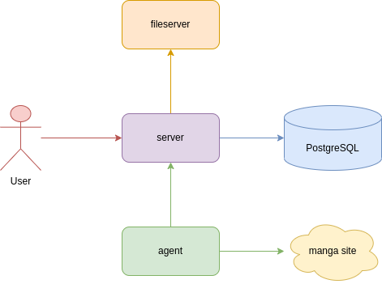

# HGraber

Граббер для манги.

## Возможности

1. Скачивать мангу с определенных сайтов
2. Просматривать скачанную мангу
3. Экспортировать мангу в формат для читалок

## Запуск

Для запуска версии в RAM достаточно выполнить команду

> make demo

## Сравнение реализаций

Все реализации поддерживают одинаковый функционал, за отличиями описанным в таблице

| Реализация | Файловое хранилище | БД           | Поддержка агента |
| ---------- | ------------------ | ------------ | ---------------- |
| Simple     | filesystem         | JDB          | ❌ - Отсутствует |
| InMemory   | InMemory           | JDB (memory) | ✅ - Есть        |
| Server     | fileserver         | PostgreSQL   | ✅ - Есть        |

## Устройство

Всего полная система может состоять из нескольких сервисов:

1. Внешнее файловое хранилище
   - Обязательно для сервера
   - Отсутствует в InMemory и простой версии
   - Предназначен для работы с удаленной внешней системой (грубо говоря MinIO на супер минималках)
2. Сам HGraber
   - Обрабатывает мангу (если нет агента)
   - Позволяет просматривать мангу
   - Позволяет ее выгружать
3. Агент
   - Опционален для сервера
   - Предназначен для обработки манги с конкретных сайтов
   - Основная цель для него это сделать возможность добавлять любые сайты без влияния на основной код HGraber
   - Дополнительно в рамках конкретных агентов можно поддержать различные особенности сайтов, например авторизацию

## Планы развития на 4-ю версию

1. Отказаться от рейтина (пока под вопросом)
   - Основная цель граббера закачивать данные, а не оценивать
2. Добавить версионирование и миграции в jdb

## TODO

1. Улучшить конфигурацию агентов (размеры очередей, лимиты и т.п.)
2. Перейти на `log/slog`
   - Пока под вопросом
3. Добавить API для того чтобы получать актуальные данные для страницы (сейчас не будет обновляться рейтинг при переключении между страницами)
4. Задокументировать API в OpenAPI
   - FileServer
   - HGraber web server
   - HGraber agent server

## Альтернативный клиент

Также есть [альтернативный клиент](https://gitlab.com/gbh007/hgraber_ui) для этого сервера на flutter

Этот клиент поддерживает функциональность частично
